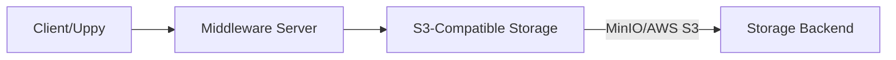

# S3-Compatible File Upload System

This document describes our file upload system that uses Uppy on the client side and a middleware server to handle secure uploads to S3-compatible storage.

## Architecture Overview



## Components

### 1. Client Side (Uppy)
- We use [Uppy](https://uppy.io/) as our client-side file upload library
- Uppy provides a modern, user-friendly interface for file uploads
- Handles file selection, preview, and progress tracking

### 2. Middleware Server
- Located in the `/uppy` directory
- Acts as a secure proxy between the client and S3 storage
- Handles authentication and signing of upload requests
- Prevents direct client access to S3 credentials

### 3. S3-Compatible Storage
- Default configuration uses MinIO
- Compatible with any S3-like storage service (AWS S3, DigitalOcean Spaces, etc.)

## Configuration

### Middleware Server Setup (.env)
Create a `.env` file in the `/uppy` directory:

```env
# S3 Configuration
COMPANION_S3_BUCKET="exulu"
COMPANION_S3_REGION="us-east-1"
COMPANION_S3_KEY="key"
COMPANION_S3_SECRET="secret"
PORT=9020
NEXTAUTH_SECRET="XXXX" # SHOULD MATCH THE SECRET SET IN THE FRONTEND AND BACKEND .env
INTERNAL_SECRET="XXXX" # SHOULD MATCH THE SECRET SET IN THE BACKEND FOLDER

# For MinIO (default)
COMPANION_S3_ENDPOINT="http://localhost:9000" # DEFAULT IF RUNNING MINIO VIA THE EXULU DOCKER COMPOSE FILE LOCALLY

# For AWS S3, comment out COMPANION_S3_ENDPOINT
# COMPANION_S3_ENDPOINT=
```

## Security Considerations

- Never expose S3 credentials in client-side code
- The middleware server handles all authenticated requests
- Use appropriate CORS settings on your S3 bucket
- Implement file type restrictions and size limits as needed

## References

- [Uppy Documentation](https://uppy.io/docs/)
- [AWS S3 Documentation](https://docs.aws.amazon.com/s3/)
- [MinIO Documentation](https://min.io/docs/minio/linux/index.html)