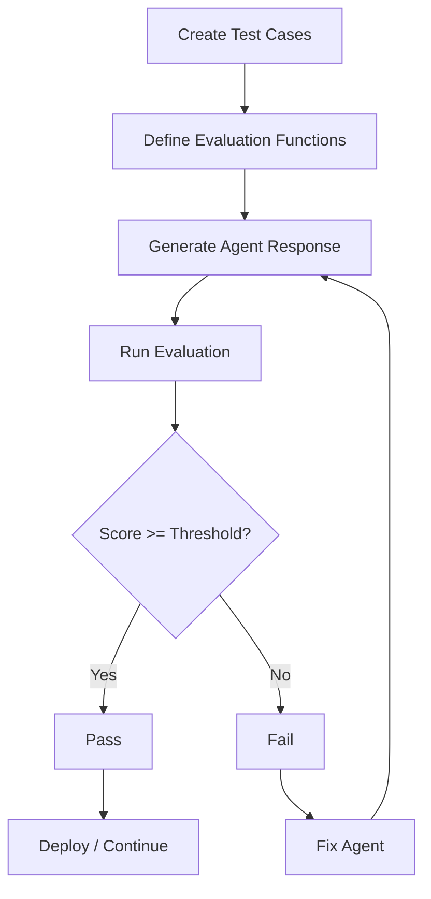

## Overview

`ExuluEval` is a class for creating custom evaluation functions that measure and score agent performance against test cases. Evaluations allow you to systematically test your agents, track quality over time, and identify areas for improvement.

## What is ExuluEval?

ExuluEval provides a framework for defining evaluation logic that:

- **Scores agent responses**: Returns a score from 0-100 based on custom criteria
- **Runs against test cases**: Evaluates agent behavior using structured test inputs
- **Supports any evaluation method**: Custom logic, LLM-as-judge, regex matching, or any scoring approach
- **Integrates with queues**: Can be run as background jobs using ExuluQueues
- **Enables A/B testing**: Compare different agent configurations, prompts, or models

<CardGroup cols={2}>
  <Card title="Custom scoring logic" icon="code">
    Write any evaluation function in TypeScript
  </Card>
  <Card title="Test cases" icon="clipboard-check">
    Structured inputs with expected outputs
  </Card>
  <Card title="LLM-as-judge" icon="scale-balanced">
    Use LLMs to evaluate response quality
  </Card>
  <Card title="Queue integration" icon="layer-group">
    Run evaluations as background jobs
  </Card>
</CardGroup>

## Why use evaluations?

Evaluations help you:

<AccordionGroup>
  <Accordion title="Measure quality">
    Quantify agent performance with consistent scoring criteria across all responses
  </Accordion>

  <Accordion title="Prevent regressions">
    Catch performance degradation when updating prompts, models, or tools
  </Accordion>

  <Accordion title="Compare configurations">
    A/B test different agent setups to find the best performing configuration
  </Accordion>

  <Accordion title="Track improvements">
    Monitor evaluation scores over time to verify that changes improve quality
  </Accordion>

  <Accordion title="Automate testing">
    Build CI/CD pipelines that fail if evaluation scores drop below thresholds
  </Accordion>
</AccordionGroup>

## Quick start

```typescript
import { ExuluEval } from "@exulu/backend";

// Create an evaluation function
const exactMatchEval = new ExuluEval({
  id: "exact_match",
  name: "Exact Match",
  description: "Checks if response exactly matches expected output",
  llm: false, // Not using LLM-as-judge
  execute: async ({ messages, testCase }) => {
    const lastMessage = messages[messages.length - 1];
    const response = lastMessage?.content || "";

    return response === testCase.expected_output ? 100 : 0;
  }
});

// Run against a test case
const score = await exactMatchEval.run(
  agent,        // Agent database record
  backend,      // ExuluAgent instance
  testCase,     // Test case with inputs and expected output
  messages      // Conversation messages
);

console.log(`Score: ${score}/100`);
```

## Evaluation types

### Custom logic evaluations

Write any scoring logic in TypeScript:

```typescript
const containsKeywordEval = new ExuluEval({
  id: "contains_keyword",
  name: "Contains Keyword",
  description: "Checks if response contains required keywords",
  llm: false,
  execute: async ({ messages, testCase, config }) => {
    const lastMessage = messages[messages.length - 1];
    const response = lastMessage?.content?.toLowerCase() || "";

    const keywords = config?.keywords || [];
    const foundKeywords = keywords.filter(kw => response.includes(kw.toLowerCase()));

    return (foundKeywords.length / keywords.length) * 100;
  },
  config: [
    {
      name: "keywords",
      description: "List of keywords that should appear in the response"
    }
  ]
});
```

### LLM-as-judge evaluations

Use an LLM to evaluate response quality:

```typescript
const llmJudgeEval = new ExuluEval({
  id: "llm_judge_quality",
  name: "LLM Judge - Quality",
  description: "Uses an LLM to evaluate response quality",
  llm: true, // Using LLM
  execute: async ({ backend, messages, testCase, config }) => {
    const lastMessage = messages[messages.length - 1];
    const response = lastMessage?.content || "";

    const prompt = `
You are an expert evaluator. Rate the quality of this response on a scale of 0-100.

Test Case: ${testCase.name}
Expected: ${testCase.expected_output}
Actual Response: ${response}

Consider:
- Accuracy: Does it match the expected output?
- Completeness: Does it address all aspects?
- Clarity: Is it well-structured and clear?

Respond with ONLY a number from 0-100.
    `;

    const result = await backend.generateSync({
      prompt,
      agentInstance: await loadAgent(config?.judgeAgentId),
      statistics: { label: "eval", trigger: "system" }
    });

    const score = parseInt(result.text);
    return isNaN(score) ? 0 : Math.max(0, Math.min(100, score));
  },
  config: [
    {
      name: "judgeAgentId",
      description: "Agent ID to use as judge"
    }
  ]
});
```

### Tool usage evaluations

Check if the agent used the correct tools:

```typescript
const toolUsageEval = new ExuluEval({
  id: "tool_usage",
  name: "Tool Usage",
  description: "Checks if agent used expected tools",
  llm: false,
  execute: async ({ messages, testCase }) => {
    // Extract tool calls from messages
    const toolCalls = messages
      .flatMap(msg => msg.toolInvocations || [])
      .map(inv => inv.toolName);

    const expectedTools = testCase.expected_tools || [];

    if (expectedTools.length === 0) return 100;

    const usedExpected = expectedTools.filter(tool => toolCalls.includes(tool));

    return (usedExpected.length / expectedTools.length) * 100;
  }
});
```

### Similarity evaluations

Use embeddings to measure semantic similarity:

```typescript
import { ExuluEval, ExuluEmbedder } from "@exulu/backend";

const similarityEval = new ExuluEval({
  id: "semantic_similarity",
  name: "Semantic Similarity",
  description: "Measures semantic similarity between response and expected output",
  llm: false,
  execute: async ({ messages, testCase }) => {
    const lastMessage = messages[messages.length - 1];
    const response = lastMessage?.content || "";

    const embedder = new ExuluEmbedder({
      id: "eval_embedder",
      name: "Eval Embedder",
      provider: "openai",
      model: "text-embedding-3-small",
      vectorDimensions: 1536,
      authenticationInformation: await ExuluVariables.get("openai_api_key")
    });

    const [responseEmb, expectedEmb] = await embedder.generate([
      response,
      testCase.expected_output
    ]);

    // Cosine similarity
    const similarity = cosineSimilarity(responseEmb, expectedEmb);

    return similarity * 100;
  }
});

function cosineSimilarity(a: number[], b: number[]): number {
  const dotProduct = a.reduce((sum, val, i) => sum + val * b[i], 0);
  const magnitudeA = Math.sqrt(a.reduce((sum, val) => sum + val * val, 0));
  const magnitudeB = Math.sqrt(b.reduce((sum, val) => sum + val * val, 0));
  return dotProduct / (magnitudeA * magnitudeB);
}
```

## Test cases

Test cases define the inputs and expected outputs for evaluations:

```typescript
interface TestCase {
  id: string;
  name: string;
  description?: string;
  inputs: UIMessage[];                      // Input conversation
  expected_output: string;                  // Expected response
  expected_tools?: string[];                // Expected tool calls
  expected_knowledge_sources?: string[];    // Expected contexts used
  expected_agent_tools?: string[];          // Expected agent tools
  createdAt: string;
  updatedAt: string;
}
```

**Example test case:**

```typescript
const testCase: TestCase = {
  id: "tc_001",
  name: "Weather query",
  description: "User asks about weather",
  inputs: [
    {
      role: "user",
      content: "What's the weather like in San Francisco?"
    }
  ],
  expected_output: "Based on current data, it's 68°F and sunny in San Francisco.",
  expected_tools: ["get_weather"],
  expected_knowledge_sources: [],
  expected_agent_tools: [],
  createdAt: "2025-01-15T10:00:00Z",
  updatedAt: "2025-01-15T10:00:00Z"
};
```

## Running evaluations

### Basic evaluation run

```typescript
import { ExuluEval, ExuluAgent } from "@exulu/backend";

const eval = new ExuluEval({
  id: "my_eval",
  name: "My Evaluation",
  description: "Custom evaluation",
  llm: false,
  execute: async ({ messages, testCase }) => {
    // Your scoring logic
    return 85; // Score from 0-100
  }
});

// Run evaluation
const score = await eval.run(
  agent,        // Agent DB record
  backend,      // ExuluAgent instance
  testCase,     // TestCase
  messages,     // UIMessage[]
  config        // Optional config
);

console.log(`Score: ${score}/100`);
```

### Batch evaluation

Run multiple evaluations on a test suite:

```typescript
async function runEvaluations(
  agent: Agent,
  backend: ExuluAgent,
  testCases: TestCase[],
  evals: ExuluEval[]
) {
  const results = [];

  for (const testCase of testCases) {
    // Generate response
    const response = await backend.generateSync({
      prompt: testCase.inputs[testCase.inputs.length - 1].content,
      agentInstance: await loadAgent(agent.id),
      statistics: { label: "eval", trigger: "test" }
    });

    const messages = [
      ...testCase.inputs,
      { role: "assistant", content: response.text }
    ];

    // Run all evals on this test case
    for (const eval of evals) {
      const score = await eval.run(agent, backend, testCase, messages);

      results.push({
        testCaseId: testCase.id,
        testCaseName: testCase.name,
        evalId: eval.id,
        evalName: eval.name,
        score
      });
    }
  }

  return results;
}
```

## Integration with ExuluQueues

Run evaluations as background jobs:

```typescript
import { ExuluEval, ExuluQueues } from "@exulu/backend";

// Create eval with queue config
const eval = new ExuluEval({
  id: "background_eval",
  name: "Background Evaluation",
  description: "Runs as background job",
  llm: true,
  execute: async ({ backend, messages, testCase }) => {
    // Evaluation logic
    return 90;
  },
  queue: Promise.resolve({
    connection: await ExuluQueues.getConnection(),
    name: "evaluations",
    prefix: "{exulu}",
    defaultJobOptions: {
      attempts: 3,
      backoff: { type: "exponential", delay: 2000 }
    }
  })
});

// Queue the evaluation job
// (Implementation depends on your worker setup)
```

## Best practices

<Tip>
  **Start simple**: Begin with basic evaluations (exact match, keyword presence) before building complex LLM-as-judge evaluations.
</Tip>

<Note>
  **Multiple evaluations**: Use multiple evaluation functions to assess different aspects (accuracy, tone, tool usage, etc.).
</Note>

<Warning>
  **Score range**: Evaluation functions must return a score between 0 and 100. Scores outside this range will throw an error.
</Warning>

<Info>
  **Test case quality**: Good test cases are specific, representative of real usage, and have clear expected outputs.
</Info>

## When to use ExuluEval

<AccordionGroup>
  <Accordion title="Agent development">
    Test agent behavior during development to catch issues early
  </Accordion>

  <Accordion title="Prompt engineering">
    Compare prompt variations to find the best performing instructions
  </Accordion>

  <Accordion title="Model comparison">
    Evaluate the same agent with different LLM models (GPT-4 vs Claude vs Gemini)
  </Accordion>

  <Accordion title="CI/CD pipelines">
    Automated testing in deployment pipelines to prevent regressions
  </Accordion>

  <Accordion title="Quality monitoring">
    Continuous evaluation in production to track performance over time
  </Accordion>
</AccordionGroup>

## Evaluation workflow



## Next steps

<CardGroup cols={2}>
  <Card title="Configuration" icon="gear" href="/core/exulu-eval/configuration">
    Learn about evaluation configuration
  </Card>
  <Card title="API reference" icon="code" href="/core/exulu-eval/api-reference">
    Explore methods and properties
  </Card>
  <Card title="ExuluAgent" icon="robot" href="/core/exulu-agent/introduction">
    Create agents to evaluate
  </Card>
  <Card title="ExuluQueues" icon="layer-group" href="/core/exulu-queues/introduction">
    Run evaluations as background jobs
  </Card>
</CardGroup>
