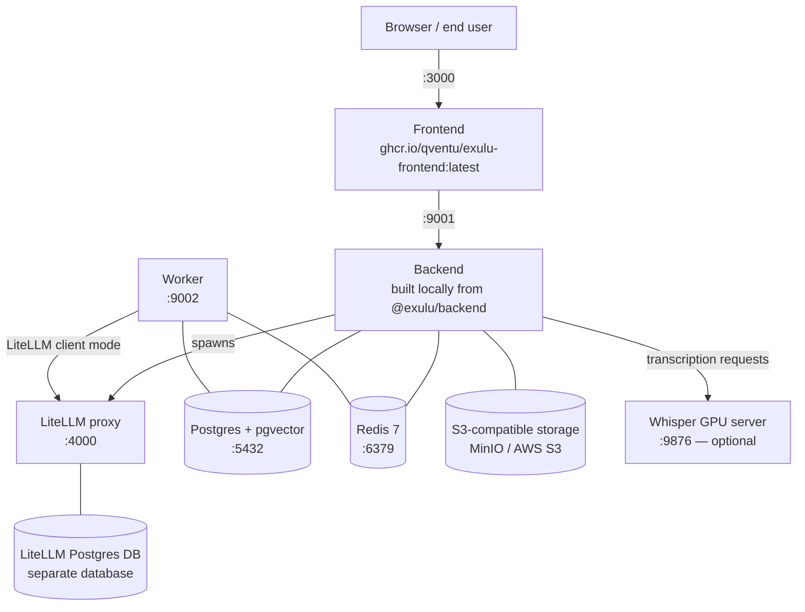

This page is for devops engineers deploying IMP on their own infrastructure. It describes every service in the stack, how they communicate, and why the two-database requirement exists.

## Service topology

## Services

### Frontend

- **Image:** `ghcr.io/qventu/exulu-frontend:latest`
- **Port:** `3000`
- **Role:** The Next.js web application. Served directly to end-user browsers. Calls the backend over the network; the backend URL is passed via `NEXT_BACKEND` at container startup.

### Backend

- **Port:** `9001` (HTTP API), `4000` (LiteLLM proxy — see below)
- **Role:** The core application server. Handles all API requests from the frontend, manages agents, knowledge, users, budgets, and jobs. There is no published Docker image — the backend is always built locally from the `@exulu/backend` npm package (public registry, no token required; see [Requirements](/self-hosting/requirements)).

### LiteLLM proxy

- **Port:** `4000`
- **Role:** An OpenAI-compatible proxy that the backend and workers use to reach LLM providers (Anthropic, Google Vertex AI, OpenAI, and others). The proxy is **spawned by the backend process** when `EXULU_USE_LITELLM=true`; you do not run it as a separate service. Port `4000` is published so that worker containers can reach the proxy directly.
- **Config:** Path set by `LITELLM_CONFIG_PATH` (defaults to `./config.litellm.yaml` in the example repo).
- **Master key:** Set via `LITELLM_MASTER_KEY`. The backend and workers authenticate against the proxy with this key.

### Worker

- **Port:** `9002`
- **Role:** Processes background jobs (knowledge ingestion, embeddings, evals, routines). Connects to the LiteLLM proxy in client mode — it does not spawn its own proxy. Workers need 8 GB of Node.js heap (`NODE_OPTIONS='--max-old-space-size=8192'`) because knowledge processing tasks can hold large document representations in memory.

### Postgres + pgvector

- **Image:** `pgvector/pgvector:pg17`
- **Port:** `5432`
- **Role:** Primary application database. Stores agents, users, sessions, knowledge items, chunks, and vector embeddings. The `pgvector` extension is required; plain Postgres without it will not work.

### LiteLLM Postgres database

- **Role:** A **separate** Postgres database used exclusively by the LiteLLM proxy for user/key management, budget tracking, and spend logging.
- **Connection string:** `LITELLM_DATABASE_URL`

<Warning>
`LITELLM_DATABASE_URL` must point to a **different database** than the IMP application database. If both env vars point to the same database, the LiteLLM proxy will run `prisma db push` against it on startup and may drop tables that belong to the IMP schema. The backend detects this condition at startup, prints a loud warning banner to the log, **skips LiteLLM database setup, and continues booting** — LiteLLM-dependent features (model routing, budget tracking, spend logging) will then fail at runtime. This misconfiguration is not fatal at boot; operators must check startup logs for the warning banner.
</Warning>

### Redis

- **Image:** `redis:7`
- **Port:** `6379`
- **Role:** Job queue backing for BullMQ. Required when running workers. Not required for backend-only deployments without background processing.

### S3-compatible storage

- **Role:** File storage for uploads (chat attachments, session files, knowledge sources). The bucket must exist before the application starts — IMP does not create it.
- **Example image (local):** `quay.io/minio/minio:RELEASE.2025-04-22T22-12-26Z`
- **Config prefix:** `COMPANION_S3_*`

### Whisper GPU server (optional)

- **Port:** `9876`
- **Role:** Transcription backend. Runs WhisperX on a GPU and exposes an HTTP endpoint the backend can call for audio/video transcription. Only required if you use the meeting transcription feature. Start it with `npx @exulu/backend exulu-start-whisper`.

## Public webhooks

Two backend HTTP endpoints must be reachable from the public internet — not only from within your Docker network.

| Endpoint | Used by | Notes |
|---|---|---|
| `POST /webhooks/email/mime` | Mailgun inbound-routing | Signed with the Mailgun webhook signing key; the backend verifies the signature before processing. The email is persisted to the database before the 2xx ACK is returned so that a restart mid-processing does not silently lose the message. |
| `POST /recall/webhooks` | Recall.ai bot events | Receives `bot.*` and `recording.done` events. The handler ACKs with 2xx before processing; the reconcile loop (see [Troubleshooting](/self-hosting/troubleshooting)) re-drives any job that is stranded by a crash between the ACK and completion. |

**Exposure guidance.** Both paths must be reachable on the public URL you registered with the respective service (Mailgun inbound route, Recall webhook subscription).

- Route traffic through your reverse proxy (Traefik, nginx, Caddy) to the backend's internal port `9001`.
- If the backend sits behind a trusted proxy that appends the real client IP to `X-Forwarded-For`, set `EXULU_TRUST_PROXY=true`. Without this flag, the raw socket address is used for rate-limit keying — which will be the proxy's IP, not the originating client's.
- Do not expose the backend port directly to the internet; keep all other routes internal.

## Network topology in production

Production deployments use Dokploy and connect services via an external Docker network named `dokploy-network`. The `docker-compose.backend.yml` and `docker-compose.worker.yml` files in the example repo reference this network. In a non-Dokploy setup, replace `dokploy-network` with a network shared across your compose stacks.

The services compose file (`docker-compose.services.yml`) uses `exulu-network` as a bridge network — suitable for local development or when all services run in a single compose project.
